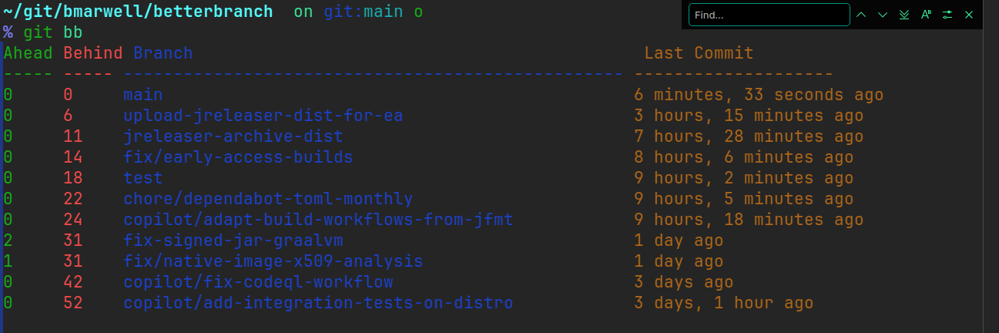
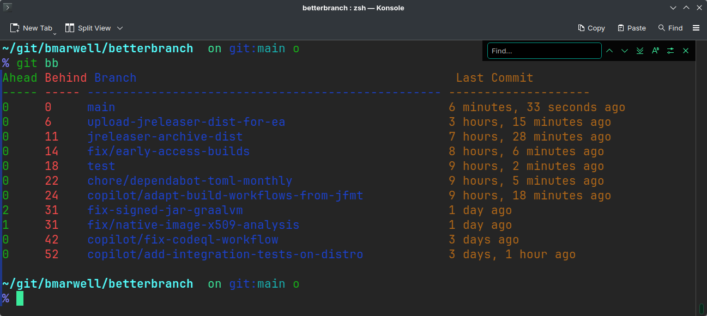

= BetterBranch
:toc:
:toc-placement!:
:sectnums:
:sectanchors:
:icons: font
:source-highlighter: rouge
:repo-url: https://github.com/bmarwell/betterbranch

image:https://github.com/bmarwell/betterbranch/actions/workflows/build.yml/badge.svg[link="https://github.com/bmarwell/betterbranch/actions",alt="Build Status"]
image:https://img.shields.io/github/v/release/bmarwell/betterbranch?sort=semver&color=green[link="https://github.com/bmarwell/betterbranch/releases",alt="Latest Release"]
image:https://img.shields.io/badge/GraalVM-Native_Image-orange?logo=graalvm&logoColor=white[GraalVM Native Image]
image:https://img.shields.io/badge/Java-Apache_Maven-C71A36?logo=apachemaven&logoColor=white[Apache Maven]
image:https://img.shields.io/github/license/bmarwell/betterbranch?color=blue[link="https://github.com/bmarwell/betterbranch/blob/main/LICENSE", alt="License"]
image:https://raw.githubusercontent.com/pachadotdev/buymeacoffee-badges/main/bmc-yellow.svg[BuyMeACoffee,link=https://buymeacoffee.com/bmarwell]

[[betterbranch-header-graphic]]

toc::[]

[[overview]]
== Overview

**BetterBranch** is a tiny command‑line tool that reports the *ahead/behind* status of all local Git branches relative to a reference branch (by default the currently checked‑out branch).
The tool is compiled to a **single static native binary** with GraalVM, so it runs without any JDK or external dependencies.

[[features]]
== Features

* Lists all local branches sorted by the author date of their tip commit.
* Shows the number of commits a branch is **ahead** of and **behind** the reference branch.
* Human‑readable age of the last commit (e.g. “5 weeks ago”, “2 years, 3 months ago”).
* Optional ANSI colour output when the terminal supports it.
* Zero‑runtime footprint – just a single executable file.

[[download]]
== Download

The latest pre‑compiled binary can be downloaded from the GitHub releases page:

[listing]
----
https://github.com/bmarwell/betterbranch/releases/latest
----

Choose the binary that matches your OS/architecture (e.g. `betterbranch-linux-amd64`, `betterbranch-osx-aarch_64`, `betterbranch-windows-amd64.exe`).

[[install-alias]]
=== Install the `git bb` alias (optional)

The binary can be copied to any directory that is on your `$PATH`.
You can create a global Git alias that simply runs the executable:

[source,sh]
----
# (1) Put the compiled binary into ~/.local/bin
#     (the file name may differ per platform – e.g. betterbranch-osx-aarch_64)
mv betterbranch-osx-aarch_64 ~/.local/bin/betterbranch

# (2) Make it executable
chmod +x ~/.local/bin/betterbranch

# (3) Add a global Git alias called “bb”
git config --global alias.bb '!~/.local/bin/betterbranch'
----

That’s it – the alias is a single line in your global ~/.gitconfig:

[source,ini]
----
[alias]
    bb = !~/.local/bin/betterbranch
----

[[usage]]
== Usage

[source,shell]
----
# Default: compare every branch against the current HEAD
./betterbranch

# or with the optional alias
git bb
----

The output format is:

.Screenshot of BetterBranch in action

[[building-from-source]]
== Building from Source

If you prefer to build the binary yourself, you need GraalVM 25+ (or any version that supports native image generation).

=== Clone the repository

[source,shell]
----
git clone https://github.com/bmarwell/betterbranch.git
cd betterbranch
----

=== Build the native image (requires GraalVM `native-image` tool)

Note: On Linux, we use `--static-nolibc`. 
This means that all libraries (including libz) are included statically, except libc.

[source,shell]
----
# Maven wrapper, uses GraalVM for the binary
./mvnw verify

# for an optimized build
./mvnw verify -Dnative.quick.build=false

# for a release build -O2
./mvnw verify -Prelease
----

The resulting executable will be in `target/`.
The build produces a statically linked binary that can be copied to any machine with the same OS/architecture, without installing a JVM.

[[contributing]]
== Contributing

Contributions are welcome! Please follow these steps:

Fork the repository.
Create a feature branch (git switch -c feature/awesome‑feature).
Make your changes and ensure the native image builds successfully.
Open a Pull Request against the main branch.
For major changes, open an issue first to discuss the proposal.

== Support

If you encounter bugs or have feature requests, open an issue on the GitHub tracker. For usage questions, feel free to start a discussion in the repository’s Discussions tab.

== License

BetterBranch is licensed under the European Union Public Licence (EUPL) v1.2.

// SPDX-License-Identifier: EUPL-1.2
